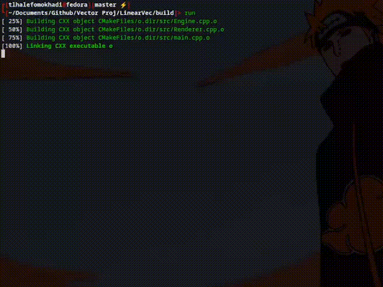

# Matrix Transformations

A simple visualisation of Matrix Transformations, mainly rotations, in 3D space

### Table of Contents
1. [Overview](#Overview)
2. [Features](#Features)
3. [Installation and Usage](#Installation-and-Usage)
4. [Learning Outcomes](#Learning-Outcomes)
5. [Demo](#Demo)
6. [Contacts](#Contacts)

### Overview 
As powerful as linear algebra is, I needed to see it for myself to believe it, and what better than 'computer graphics'.
This project is not intended for any use (for now I hope) , it just serves as a visualiser for me. It demonstrates the effects of matrix transformations on vectors. Unfortunately I've not learned anything new about C++ in the making of this project. I will however try to implement SIMD (Single Instruction Multiple Data)

### Features
Makes uses of a perspective projection matrix to map a 3D object onto a 2D space.
The rotation matrices used are also fixed and hard-coded, interactively what not in the scope of this project
The function below applies; rotations around z axis, rotations around x axis then scales from unit vectors to the coordinate system that corresponds to that of SDL2
```C++
engine.update(delta_rotation_x,delta_rotations_z);
```

### Installation and Usage
#### Pre-Requisites
- CMake v3.3x
- C++ 23 
- Any C++ compiler
- SDL2 
>**Note:** This project assumes you have SDL2 installed as a system header

#### Steps
clone this repo
```
git clone https://github.com/player0-glitch/Vector3D.git
cd Vector3D

# Build 
mkdir build && cd build
make 
#Run the program
./o
```

You can use cmake as you see fit, this is just my recommendation 

```
#To use Makefiles as your build tool
cmake .. -G "Unix Makefiles" 

#To use Ninja as your build tool 
cmake .. -G "Ninja" 
make 

#Run 
./o
```

### Learning Outcomes 
Deepened my understanding of matrix Transformations and how powerful they are, particularly the perspective projection matrix.
Learned about the importance of order when it comes to rotationational matrices. Implemented frame independent rendering.
Most importantly I've learnt to used ```perf record -g``` to profile what sections/symbols in my program were the slowest. This deeply improved my debugging skills

### Demo 
Proof of concept 



### Roadmap
- [ ] Implement interactively where angles of rotation can be changed
- [ ] Use ImGui to add interactively to the project 
- [ ] Allow for zooming in and out 
- [ ] Add more shapes (Pyramids,Prisms, etc) 

### Contacts
email: [mokhaditlhalefo@gmail.com](mailto:mokhaditlhalefo@gmail.com)

LinkedIn: [linkedin.com/in/mokhaditlhalefo](https://www.linkedin.com/in/tlhalefo-mokhadi-445b05226/)

github: you're already here but okay [github.com/player0-glitch](https://github.com/player0-glitch)
